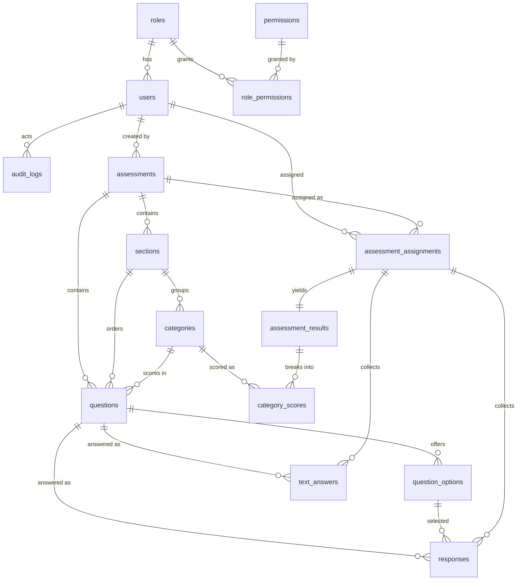

# PROJECT.md — Business Health / Financial Maturity Assessment (Single Organisation)

> Source of truth for implementation. A coding agent must be able to build v1 from this file alone.
> Rule: the Excel workbook is the primary source for survey content. Nothing in §2 marked
> "directly present" may be reworded, dropped, or re-scored without a product-owner decision.
> Everything not in the Excel is labeled `INFERENCE`, `ASSUMPTION`, `RECOMMENDATION`, or `NEEDS CONFIRMATION`.

Source file inspected: `Survey - Finance.xlsx`
(3 sheets: `Survey Questions`, `Survey Results`, `Sheet1`. Inspection date: 2026-09-07.
Workbook contains **no macros, no hidden sheets, no named ranges, no conditional formatting,
no comments**; only plain values, `AVERAGE`/`MIN`/`MAX` formulas, and one list validation.)

Tech stack (fixed): React 19 + Vite SPA (frontend) + Hono API + TypeScript + PostgreSQL
+ Prisma ORM + Auth.js (@auth/core, database sessions) + Tailwind CSS + shadcn/ui + Zod
+ React Hook Form + Recharts. Deploy on Vercel (single project: static frontend + serverless API).
Architecture: modular monolith in one repo (`client/` + `server/` + thin `api/` Vercel wrapper).
No separate backend host. Package manager + local dev runtime: Bun. Production API runtime:
Node.js (Vercel serverless does not execute Bun — server code must avoid Bun-only APIs).
Scope: **ONE organisation only.** No multi-tenancy in v1.

> **Spec-change note (2026-09-07):** normalized lookup tables (`assessment_types`,
> `assessment_statuses`, `question_types`), the `question_versions` table, the `insights` table,
> the `interpretation_bands` table, and `published_snapshot` were removed (23 → 18 tables incl.
> Auth.js). Seed-only value sets with no Admin lifecycle became CHECK'd strings / code config;
> history safety moved from versioning to direct-edit + frozen-structure (§5.4, §6.5, §13).
> Reintroduce any dropped table only via migration + the trigger stated in its NOTE comment.
>
> **Spec-change note (2026-09-07, auth):** replaced admin-set temporary passwords +
> `must_change_password` flag with email-based reset (generic SMTP/Nodemailer, hashed single-use
> tokens in `verification_tokens`, console-log fallback in dev). Affected: FR-1/FR-3, §6.4, §9 auth
> + user endpoints, §10.1, §11, §14, §17 (`SMTP_*`, `APP_URL`), §20, §21-Q12, §22 Phases 3/7, §23-11.

---

## 1. Project Overview

### 1.1 What this application is (plain language)

This is a **Business Health / Financial Maturity Assessment application** for a single organisation.
Employees (and managers / top management) answer a structured finance-literacy questionnaire.
The system scores the answers, aggregates them into category and overall scores, highlights weak
areas, shows interpretation texts ("what this score means"), and tracks improvement over time when
assessments are repeated.

**It is NOT merely a survey/form application.** Forms are only the data-capture step. The product
value is:

```text
Assess → Score → Identify weak areas → Prioritize problems → Generate/display insights
       → Track improvement over time
```

- **Assess:** assigned users answer the seeded finance questionnaire (self perspective + organisation perspective) plus open-ended prompts.
- **Score:** the backend converts each selected option to its numeric score and aggregates to category and overall scores. The frontend never decides scores.
- **Identify weak areas:** category averages (Knowledge / Usage as tool / Decision Making) and, if in scope, broader business-health categories, ranked lowest-first.
- **Prioritize problems:** lowest categories and the open-ended "problems / areas to improve" answers surface what to fix first. `RECOMMENDATION`: implement a simple priority rule (lowest score = highest priority) rather than claiming the Excel defines one — it does not.
- **Generate/display insights:** per-category interpretation texts mapped from score bands (see §8; the only verbatim insight texts in the workbook live in `Sheet1`, whose v1 scope is unconfirmed — see §2.6).
- **Track improvement over time:** repeated submissions of the same assessment produce a history and trend chart per user and (for permitted roles) per organisation.

### 1.2 Users and intent

Four roles, one organisation (§4 for the permission matrix; role ≠ automatic access — every
assessment/result access additionally requires an assignment/scope check):

| Role | Intent |
|---|---|
| `ADMIN` | Full system administration: users, roles, assessment configuration, seeded questions/options, configurable scoring metadata, reports, settings. |
| `TOP_MANAGEMENT` | Takes assessments; sees organisation-level insights as permitted. Senior title alone grants nothing — permissions are explicit (§4). |
| `MANAGER` | Takes assigned assessments; sees permitted results (own + explicitly shared/aggregated results). |
| `EMPLOYEE` | Takes assigned assessments; sees own results. |

No consultant/advisor role in v1. `NEEDS CONFIRMATION`: whether top management should see
identifiable individual answers or only anonymised aggregates (default in this spec: aggregates only
unless explicitly assigned — see §4, §13).

---

## 2. Source Analysis

### 2.1 Workbook purpose (directly present + minimal inference)

- **Directly present:** a finance questionnaire (`Survey Questions`), a scoring sheet
  (`Survey Results`), and a third sheet (`Sheet1`) with general business-health categories and
  interpretation texts.
- **Inference:** the workbook is a paper/Excel-first assessment instrument being digitised. The
  "Response" column + list validation + cross-sheet formulas are the prototype of the app's
  take-assessment → scoring flow.
- **Directly present purpose words:** "About self", "About organisation", "financial statements
  like Balance Sheet, Profit & Loss Statement and Cash flow statements", "health of organisation",
  "Decision Making", "Usage as tool", "Knowladge [sic]", "Interpretation", "Expected", "Max. Possible".
- **NEEDS CONFIRMATION:** who the original respondents were (all employees vs. managers only),
  whether Self and Organisation sections are one assessment or two, and whether `Sheet1` belongs
  to this Finance v1 at all (it references an external workbook — §2.6).

### 2.2 Target audience (directly present vs. missing)

- **Directly present:** Section 1 speaks in first person ("I know…", "I evaluate…", "my decisions…")
  → the individual respondent. Section 2 speaks about "top management and decision makers" in third
  person ("In your company, top management…") → any employee reporting their *perception* of leadership.
- **Missing from Excel:** no named personas, no employee/manager split, no anonymity rules, no
  assignment workflow. All of that is `INFERENCE / ASSUMPTION` in §§3–4 and confirmed as open
  questions in §21.

### 2.3 Sections (directly present, verbatim)

| # | Excel label (verbatim) | Location | Content |
|---|---|---|---|
| S1 | `Section 1:  About self` | `Survey Questions!A4` | Scored Q1–Q7 + open Q8 |
| S2 | `Section  2:  About organisation   ` | `Survey Questions!A45` | Scored Q1–Q7 + open Q16 (numbered "16." in source) |

Note the source numbering anomaly: the last open question in S2 is labeled **`16.`**, not `8.`
Do not "fix" this in seed data silently — seed `source_number = "16"` and add a human-readable
`display_order`. See §15.

### 2.4 Individual/self assessment (directly present — full transcription)

Rubric for S1 Q1–Q7: four options scored **a=100, b=75, c=50, d=25** (column F "Max Score").
Column G "Response" accepts only `25,50,75,100` (list validation `G5:G40, G46:G85`).
Question stems below are normalised for whitespace only; wording is otherwise verbatim.

- **S1-Q1:** "I know, how to read financial statements like Balance Sheet, Profit & Loss Statement and Cash flow statements:"
  - a. "I know how to read financial statements" — 100
  - b. "I need help to read financial statements" — 75
  - c. "I don't feel it is needed for me" — 50
  - d. "I think, it is not applicable for me" — 25
- **S1-Q2:** "I know, how financial statements like Balance Sheet, Profit & Loss Statement and Cash flow statements indicate health of organisation:"
  - a. "I know" — 100 / b. "I know partially" — 75 / c. "I am not aware" — 50 / d. "I think, it is not applicable for me" — 25
- **S1-Q3:** "I evaluate financial health of organisation using financial statements like Balance Sheet, Profit & Loss Statement and Cash flow statements:"
  - a. "I evaluate financial health of organisation using financial statements" — 100
  - b. "I need help to evaluate financial health of organisation using financial statements" — 75
  - c. "I am not aware" — 50 / d. "I think, it is not applicable for me" — 25
- **S1-Q4:** "I know, inter linkages between financial statements like Balance Sheet, Profit & Loss Statement and Cash flow statements:"
  - a. "I know" — 100 / b. "I know partially" — 75 / c. "I am not aware" — 50 / d. "I think, it is not applicable for me" — 25
- **S1-Q5:** "I am aware of how my decisions are reflected in financial statements:"
  - a. "I am aware" — 100 / b. "I am not aware" — 75
  - c. "I don't feel it is important to know it" — 50 / d. "I think, it is not applicable for me" — 25
- **S1-Q6:** "I take appropriate actions to improve organisational performance based on interpretation of financial statements:"
  - a. "I take appropriate actions…" — 100 / b. "Sometimes, I take actions…" — 75
  - c. "I don't feel it is needed" — 50 / d. "I think, it is not applicable for me" — 25
- **S1-Q7:** "I do feel necessary to improve my knowledge about organisation's financial statements for professional growth:"
  - a. "I do have adequate knowledge about organisation's financial statements" — 100
  - b. "I do feel to improve my organisational financial literacy" — 75
  - c. "I don't feel to improve my organisational financial literacy" — 50
  - d. "I think, it is not applicable for me" — 25
- **S1-Q8 (open-ended, unscored):** "List down 4 areas where you want to improve your knowledge about organisation's financial activities:" with sub-rows `a.`, `b.`, `c.` (three rows present, `R41–R43`; `R44` is blank).
  `TODO / NEEDS CONFIRMATION`: prompt says **4** areas but only **3** labelled sub-rows exist. Seed 4 text slots (a–d) to match the prompt and flag the discrepancy to the product owner; do not silently seed only 3.

### 2.5 Organisation assessment (directly present — full transcription)

Same 100/75/50/25 rubric. Stems are perceptions of leadership, not self-statements.

- **S2-Q1:** "In your company, top management and decision makers can read financial statements like Balance Sheet, Profit & Loss Statement and Cash flow statements"
  - a. "Top management and decision makers can read financial statements" — 100
  - b. "Top management and decision makers need help to read financial statements" — 75
  - c. "They don't feel need of it" — 50 / d. "I think, they need not to know it" — 25
- **S2-Q2:** "In your company, top management and decision makers know that financial statements like Balance Sheet, Profit & Loss Statement and Cash flow statements indicate health of organisation"
  - a. "Top management and decision makers know about it" — 100
  - b. "Some of top management and decision makers know it partially" — 75
  - c. "They are not aware" — 50 / d. "I think, they need not to know it" — 25
- **S2-Q3:** "In your company, top management and decision makers evaluate financial health of organisation using financial statements like Balance Sheet, Profit & Loss Statement and Cash flow statements:"
  - a. "…evaluate financial health of organisation using financial statements" — 100
  - b. "Some of top management and decision makers can partially evaluate…" — 75
  - c. "They are not aware" — 50 / d. "I think, they need not to know it" — 25
- **S2-Q4:** "In your company, top management and decision makers know inter linkages between financial statements like Balance Sheet, Profit & Loss Statement and Cash flow statements:"
  - a. "…know inter linkages between financial statements" — 100
  - b. "Some … know partially inter linkages between financial statements" — 75
  - c. "They are not aware" — 50 / d. "I think, they need not to know it" — 25
- **S2-Q5:** "In your company, top management and decision makers are aware of how their decisions are reflected in financial statements:"
  - a. "…are aware of how their decisions are reflected in financial statements" — 100
  - b. "…are not aware of how their decisions are reflected in financial statements" — 75
  - c. "They don't feel it is important to know it" — 50 / d. "I think, they need not to know it" — 25
- **S2-Q6:** "In your company, top management and decision makers take appropriate actions to improve organisational performance based on interpretation of financial statements:"
  - a. "…take appropriate actions…" — 100 / b. "Sometimes, …take actions…" — 75
  - c. "They don't feel it is needed" — 50 / d. "I think, they need not to know it" — 25
- **S2-Q7:** "In your company, it is necessary to improve knowledge of top management and decision makers, about organisation's financial statements for effective organisational performance:"
  - a. "They do have adequate knowledge about organisation's financial statements" — 100
  - b. "They feel, need to improve knowledge about organisation's financial statements" — 75
  - c. "They don't feel, need to improve knowledge about organisation's financial statements" — 50
  - d. "I think, they need not to know it" — 25
- **S2-Q16 (open-ended, unscored, source number "16."):** "In your company, list down 4 problems related to financial activities affecting overall performance:" with sub-rows `a.`–`d.` (`R82–R85`).

### 2.6 Question patterns, answer options, open-ended questions

- **Pattern (direct):** every scored question has exactly 4 single-select options, monotonically
  descending 100 → 75 → 50 → 25. Option `d` is always an opt-out ("not applicable for me" in S1;
  "they need not to know it" in S2) — yet it still scores **25**, not 0. This is a source fact with
  scoring consequences (§8): opt-outs inflate the floor to 25.
- **Response encoding (direct):** the respondent's choice is stored as the *score number* (G column),
  constrained by list validation to `{25,50,75,100}`. There is no separate option-code column.
  `INFERENCE` for the app: store both `question_option_id` (which option) and the denormalised
  `score_value` at answer time (server-resolved; keeps computed results stable even if Admin later
  edits option scores).
- **Open-ended (direct):** 2 parent prompts (S1-Q8, S2-Q16) with 3–4 blank sub-rows, no scores, no
  validation. They are unscored free text. `ASSUMPTION`: each sub-row is one text answer slot
  (S1-Q8 ×4 slots pending confirmation; S2-Q16 ×4 slots).
- **What is NOT in the Excel:** no multi-select, no ratings scale other than 100/75/50/25, no
  mandatory/optional flags, no branching, no weights, no time limits.

### 2.7 Scoring / interpretation information (directly present)

`Survey Results` sheet (all formulas verified during inspection):

| Perspective | Category (verbatim, incl. source typo) | Questions averaged | Formula |
|---|---|---|---|
| Self | `Knowladge` [sic] | S1-Q1, S1-Q2 | `G4 = AVERAGE(F4:F5)` |
| Self | `Usage as tool` | S1-Q3, S1-Q4 | `G6 = AVERAGE(F6:F7)` |
| Self | `Decision Making` | S1-Q5, S1-Q6, S1-Q7 | `G8 = AVERAGE(F8:F10)` |
| Organisation | `Knowladge` [sic] | S2-Q1, S2-Q2 | `G11 = AVERAGE(F11:F12)` |
| Organisation | `Usage as tool` | S2-Q3, S2-Q4 | `G13 = AVERAGE(F13:F14)` |
| Organisation | `Decision Making` | S2-Q5, S2-Q6, S2-Q7 | `G15 = AVERAGE(F15:F17)` |

- Each `Score (F)` cell is a direct link: `='Survey Questions'!G<row>`.
- `Overall Average (H4)` = `AVERAGE(G4:G10)` — i.e. the average of the *category averages*
  (3 real values + blank-cell handling), and `H11 = AVERAGE(G11:G17)` for Organisation.
  `Min`/`Max` = `MIN`/`MAX` of the same category-average range.
- **Directly present:** no weights, no "Expected" column, no interpretation texts on this sheet.
  Min/Max here are *observed* min/max of category averages, not maturity bands.

`Sheet1` — **broader business-health areas (scope unconfirmed):**

- 7 categories with per-category interpretation quads and `Max. Possible = 100`, `Expected = 75`:
  `Growth` (2 statements), `Customer` (2), `Leadership` (3), `Partners & Resources` (2),
  `People - HR` (4), `Process` (3), `Strategy & Plan` (3) — 19 statements total.
- Bands (header row verbatim): `(100 - 75.01)`, `(75 - 50.01)`, `(50 - 25.01)`, `(25 - 0.0)`.
  Example (`Growth`): 100–75.01 "Organisation's topline has grown with improved profitability
  irrespective of situations / 'Keep Moving'"; 75–50.01 "…not in sync. / 'Needs fine tuning'";
  50–25.01 "Stagnancy or degrowth… / 'Needs immeadiate Attention'" [sic]; 25–0 "…already is in
  serious trouble / 'Needs Complete Revamping'". (Full texts for all 7 categories are in the sheet;
  seed them only if `Sheet1` is confirmed in scope — §15.)
- **Critical source fact:** every `Score (F)` formula in `Sheet1` references an **external workbook**:
  `='[1]Survey Statements - General'!G<n>` (Statement No. 1–20, non-sequential). That workbook is
  **not provided**. So `Sheet1` cannot be seeded as questions — only as *reference category +
  interpretation metadata*, pending confirmation. Default: **out of v1 scope** (§20); model supports
  adding it later without schema changes (§6 `categories`, `insights`).

### 2.8 What is directly present vs. inferred vs. needs confirmation

| # | Item | Status |
|---|---|---|
| 1 | S1 Q1–Q7 + options + 100/75/50/25 scores | DIRECT |
| 2 | S2 Q1–Q7 + options + 100/75/50/25 scores | DIRECT |
| 3 | S1-Q8 and S2-Q16 open-ended prompts + blank sub-rows | DIRECT (row counts ambiguous — TODO) |
| 4 | Response domain {25,50,75,100} via list validation | DIRECT |
| 5 | Category groupings + AVERAGE/MIN/MAX formulas | DIRECT |
| 6 | `Sheet1` 7 business-health categories + interpretation quads + bands + Expected 75 | DIRECT (but scope + external refs unconfirmed) |
| 7 | Auth, roles, assignment, dashboards, trends, exports | NOT IN EXCEL — product inferences, §§3–4, 11–12 |
| 8 | Weights, mandatory flags, "not applicable = 0", maturity labels | NOT IN EXCEL — must not be invented (§8 placeholder) |
| 9 | Whether S1+S2 are one assessment or two; reassessment rules; result visibility | NEEDS CONFIRMATION (§21) |
| 10 | Source typos (`Knowladge`, `immeadiate`, `priotaritisation`, `Organisaton`) | DIRECT — preserve in seed `source_text`, normalise only in display/separate column |

---

## 3. Functional Requirements

### FR-1 Login / authentication
- Email + password login via Auth.js (credentials provider). Sessions: database sessions
  (see §14). No social login, no SSO in v1.
- Password reset is **email-based** (generic SMTP via Nodemailer, `server/lib/email/`): user requests
  a link → single-use hashed token in `verification_tokens` (1h TTL) → link logged to console in dev,
  emailed in prod. No temporary passwords, no `must_change_password` flag. Account lockout after
  repeated failures (`ASSUMPTION`: 5 attempts → 15-min lock; configurable in `settings`).
- Validation with Zod on auth DTOs; generic "invalid credentials" error (no user enumeration);
  forgot-password always returns 200 (no enumeration).

### FR-2 RBAC
- Single-organisation RBAC: `users → roles → permissions` (§6). Four seed roles (§4).
- Every API and every page performs **server-side** authentication + permission + (where relevant)
  assignment/scope checks. Role name alone never authorises; the `role_permissions` join does.
- Admin UI to assign/revoke roles and activate/deactivate users. Permission catalogue itself is
  seed-managed (code-defined), not admin-editable in v1 (`ASSUMPTION` — prevents privilege escalation).

### FR-3 User management (Admin)
- CRUD users (name, email, role, active flag), search/paginate, activate/deactivate, assign role,
  trigger password-reset email. Deactivation preserves history (never hard-delete users with responses; §13).
- Audit log records actor, action, target, timestamp (§14).

### FR-4 Assessment management (Admin)
- CRUD assessments (title, description, type, status lifecycle `DRAFT → PUBLISHED → CLOSED`,
  open/close dates). Sections and categories managed under an assessment.
- Publish makes an assessment assignable/takeable; Closed stops new starts/submissions but keeps
  results readable. `ASSUMPTION`: published assessments are structure-frozen (no add/remove/retype
  of questions or options after publish — §5, §13).

### FR-5 Assessment assignment (Admin/privileged)
- Admin assigns a published assessment to users (individual select and/or "all active users").
  Assignment = row in `assessment_assignments` with status
  `ASSIGNED → IN_PROGRESS → SUBMITTED` (+ `EXPIRED` if past due date).
- `ASSUMPTION`: one active assignment per (user, assessment) at a time; reassessment = new
  assignment created after submission (rules §13). Due dates optional.

### FR-6 Taking an assessment
- Assignee sees "My Assessments" (assigned, in-progress, submitted). Start → answer section by
  section (S1 then S2). Single-select scored questions (radio) + free-text slots for open prompts.
- Autosave draft (debounced PUT) + explicit Save; Resume later. Client shows completion progress
  (answered/required). All writes validated server-side with Zod; option IDs must belong to
  questions of the assignment's assessment.

### FR-7 Saving progress
- Draft responses stored per (assignment, question). Scored answers upsertable until submit;
  text answers likewise. Draft never creates a result row.

### FR-8 Submitting assessment
- Submit requires all *required* scored questions answered (`ASSUMPTION`: all scored questions
  required by default; open-text slots optional — NEEDS CONFIRMATION). Submit is irreversible
  (creates immutable result snapshot). Duplicate submit rejected (idempotency key / status guard).

### FR-9 Result calculation (backend only)
- On submit, a server transaction validates → scores each response from the frozen option scores →
  aggregates category averages → overall averages → min/max → interpretation-band lookup → insight
  rows. Exact formulas mirror the Excel (§8). Frontend displays only; any client-side preview must
  be labelled estimate and never persisted.

### FR-10 Dashboards
- Personal dashboard (own latest + history + trend), Manager dashboard (permitted aggregates),
  Top-Management organisation dashboard (aggregates across submitted assignments), Admin dashboard
  (completion, distribution, user management shortcuts). See §12.

### FR-11 Category-level results
- Per submission: 6 finance categories (Self/Org × Knowledge/Usage/Decision Making) with average,
  contributing question scores, band label, and weak-area flag. `Sheet1` categories appear only if
  confirmed in scope.

### FR-12 Insights / recommendations
- Rule-based insights composed on read from band config (code, not DB). No AI/LLM generation in v1
  (§20). Each insight carries the band, text, and priority (lowest score first).
  `RECOMMENDATION`: add "weakest category" + "most improved since last attempt" cards as product
  logic, clearly labelled as product (not Excel) features.

### FR-13 Historical results
- Every submission keeps its immutable result + category scores + insights. "My Results" lists all
  attempts with trend chart (Recharts). Organisation history aggregates by period.
  Question edits after submission never mutate computed history (immutable results, §5/§13).

### FR-14 Admin question management
- Admin CRUDs sections/categories/questions/options **freely on DRAFT assessments**; on PUBLISHED
  assessments text/order edits only (structural changes → 409, new assessment instead).
  Options carry fixed `score_value` (100/75/50/25 seeded).
  `NEEDS CONFIRMATION`: whether Admin may edit score values at all (default: yes, gated by
  `questions.scores.manage`).

### FR-15 Reporting / export
- v1: on-screen reports + print-friendly result view (`window.print` CSS). CSV export of
  aggregated (non-identifiable) results: `RECOMMENDATION`, permission-gated, marked as v1-included
  only if confirmed; otherwise Phase 7/future. PDF export, scheduled email reports: future scope.

---

## 4. RBAC Matrix

Permissions are fine-grained strings checked server-side (`permission(code)` helper + route/page
guards). Assignment/scope checks apply on top (even with the permission, a user can only touch
assignments/results they are entitled to — §13).

| Capability | Admin | Top Mgmt | Manager | Employee |
|---|:---:|:---:|:---:|:---:|
| Users: list/view (`users.view`) | ✅ | ❌ | ❌ (team list `RECOMMENDATION`, default ❌) | ❌ |
| Users: create/update/role/activate (`users.manage`) | ✅ | ❌ | ❌ | ❌ |
| Roles/permissions: view catalogue | ✅ | ❌ | ❌ | ❌ |
| Assessments: create/update/publish/close (`assessments.manage`) | ✅ | ❌ | ❌ | ❌ |
| Assessments: view published (assigned scope) | ✅ | ✅ own assigned | ✅ own assigned | ✅ own assigned |
| Questions/sections/categories: manage (`questions.manage`) | ✅ | ❌ | ❌ | ❌ |
| Question score values: manage (`questions.scores.manage`) | ✅ | ❌ | ❌ | ❌ |
| Assignments: create/list all (`assignments.manage`) | ✅ | ❌ | ❌ | ❌ |
| Assignments: view own (`assignments.self.view`) | ✅ | ✅ | ✅ | ✅ |
| Assignments: answer/submit own (`assignments.self.respond`) | ✅* | ✅ | ✅ | ✅ |
| Own results: view (`results.self.view`) | ✅ | ✅ | ✅ | ✅ |
| Organisation aggregates: view (`results.org.view`) | ✅ | ✅ | ❌† | ❌ |
| Identifiable individual results: view (`results.individual.view`) | ✅ | ❌‡ | ❌ | ❌ |
| Reports/export (`reports.view` / `reports.export`) | ✅ | ✅ view only | ❌ | ❌ |
| Settings: manage (`settings.manage`) | ✅ | ❌ | ❌ | ❌ |

\* Admin *can* hold an assignment for testing, but `ASSUMPTION`: production admin accounts are not
routinely assigned assessments.
† `RECOMMENDATION`: Managers get team-aggregate view only if the owner confirms team structure
(a `teams`/`departments` model is **not** in v1 — no team tables exist; adding teams is future scope).
‡ Default denies Top Management access to identifiable individual answers (aggregate-only). Granting
`results.individual.view` to Top Management is a product-owner decision (§21).

Seed permissions catalogue (authoritative string codes): `users.view`, `users.manage`,
`assessments.manage`, `questions.manage`, `questions.scores.manage`, `assignments.manage`,
`assignments.self.view`, `assignments.self.respond`, `results.self.view`, `results.org.view`,
`results.individual.view`, `reports.view`, `reports.export`, `settings.manage`.

---

## 5. Assessment Model

### 5.1 Assessment type (bare string, no table)
- `assessments.type` is a plain string defaulting to `FINANCIAL_MATURITY` (the Excel finance
  instrument — v1). No `assessment_types` table and no speculative seed rows
  (`GENERAL_BUSINESS_HEALTH`, `CUSTOM` are not seeded). If a second family ever needs
  Admin-managed metadata, reintroduce a table via migration.
- Type may determine default sections/categories at creation (cloned from seed templates), but
  structure remains editable pre-publish.

### 5.2 Sections (`sections`, seeded from Excel)
- v1 Finance assessment has exactly 2 sections, seeded verbatim:
  1. `Section 1: About self` (display title; `source_text` keeps original spacing),
  2. `Section 2: About organisation`.
- Columns: order, title, description (nullable), assessment FK. Admin may edit titles/descriptions
  pre-publish; structural changes post-publish are frozen (§10/§13 frozen-structure rule).

### 5.3 Categories (`categories`, seeded from Excel)
- 6 finance categories seeded under their section (note: source spelling `Knowladge` preserved in
  `source_text`, normalised display name `Knowledge`):
  - S1: Knowledge (S1-Q1,Q2) · Usage as tool (S1-Q3,Q4) · Decision Making (S1-Q5,Q6,Q7)
  - S2: Knowledge (S2-Q1,Q2) · Usage as tool (S2-Q3,Q4) · Decision Making (S2-Q5,Q6,Q7)
- `Sheet1`'s 7 categories (Growth, Customer, Leadership, Partners & Resources, People-HR, Process,
  Strategy & Plan) are **not seeded as v1 categories** unless confirmed (§15); the table supports
  them without migration.

### 5.4 Questions / options (seeded from Excel, Admin-manageable; no versions table)
- `questions` carry everything directly: `type` (`SINGLE_SELECT` scored / `TEXT_MULTI_SLOT`
  open-ended parent, CHECK'd string — no `question_types` table), section/category FKs, prompt
  text, required flag, order, status (`DRAFT|ACTIVE|DEPRECATED`), `slot_count` for open parents.
  **Responses always FK to the question itself.** `question_options` belong to a question
  (label, `score_value`, order); option order `a–d` and scores 100/75/50/25 seeded exactly.
- Open-ended parents (S1-Q8, S2-Q16): one `questions` row of type `TEXT_MULTI_SLOT` with
  `slot_count` (4 default; S1-Q8 seeded 4 with TODO flag) and zero options; answers live in
  `text_answers` (one row per slot).
- Which concepts are seeded vs. configurable:

| Concept | Seeded from Excel | Admin-configurable |
|---|---|---|
| Sections (2), categories (6), questions (14 scored + 2 open), options (56) + scores | ✅ exact | Text/descriptions/order anytime; structural changes frozen once published (§13) |
| Category groupings + aggregation formulas | ✅ (formulas mirrored in code) | ❌ (code change; not runtime-editable) |
| Interpretation bands + `Sheet1` texts | ⚠️ band ranges yes, as code config; texts only if `Sheet1` confirmed | ❌ in v1 (code change; bands table returns only if §21-Q8 confirms configurability) |
| New questions/categories, required flags, slot counts | — | ✅ on DRAFT assessments (frozen once published) |
| Computed results | — | ❌ immutable by design |

### 5.5 Scoring (summary; full spec §8)
- Option `score_value` ∈ {100,75,50,25} (seeded; check-constrained). Question score = selected
  option's score. Category score = arithmetic mean of its question scores. Overall (per
  perspective Self/Organisation) = mean of its 3 category scores. Min/Max = min/max of those 3.
  Band lookup maps a score to an interpretation. All computed server-side in one transaction.

### 5.6 Text answers
- Unscored, optional (`ASSUMPTION`), stored per (assignment, question, slot_index).
  Editable until submit. Visible to the respondent + Admin (+ Top Mgmt aggregates only as counts/
  excerpts if explicitly permitted — default: not visible; §13).

### 5.7 Assignments / submissions / results
- `assessment_assignments`: (assessment, assignee, status, due date, attempt number).
  Draft answers accumulate in `responses`/`text_answers` keyed to the assignment.
- Submit → status `SUBMITTED` + one `assessment_results` row + N `category_scores` rows, all
  immutable. Insights are composed on read from category averages + scoring config
  (no `insights` table, no stored band labels). Reassessment = new assignment (attempt+1); history preserved.

---

## 6. Database Schema

Conventions: PostgreSQL via Prisma. PKs `TEXT` (cuid/uuid, `default(cuid())`) except where noted;
FKs indexed; `created_at timestamptz default now()`, `updated_at timestamptz` (trigger/`@updatedAt`).
` citext`-style case-insensitive email: `UNIQUE` on `lower(email)` (Prisma: `email` unique + app-level
normalisation + DB unique index on expression via migration). Soft-delete: none for survey content
(status flags instead); users deactivated, never hard-deleted while referenced.
Fixed-domain strings (`status`, `type`, `score_value`) use TEXT/INT + SQL CHECK constraints
(Prisma has no native CHECK). Total: **18 tables** (15 domain + Auth.js `accounts`/`sessions`/
`verification_tokens`). Spec change 2026-09-07 reversed the earlier normalized-lookup requirement
for seed-only value sets (see change note at top of file).

### 6.1 `roles`
Purpose: the 4 role identities. Lookup table, seeded, not runtime-created in v1.
| Column | Type | Null | Constraints |
|---|---|---|---|
| `id` | TEXT | NOT NULL | PK |
| `code` | TEXT | NOT NULL | UNIQUE (`ADMIN`,`TOP_MANAGEMENT`,`MANAGER`,`EMPLOYEE`) |
| `name` | TEXT | NOT NULL | display name |
| `description` | TEXT | NULL | |
| `created_at` / `updated_at` | TIMESTAMPTZ | NOT NULL | |
Indexes: PK; UNIQUE(code). Business rules: codes immutable; seed-only in v1.

### 6.2 `permissions`
Purpose: stable permission catalogue (code-defined strings, §4). Seeded; Admin cannot create new codes in v1.
| Column | Type | Null | Constraints |
|---|---|---|---|
| `id` | TEXT | NOT NULL | PK |
| `code` | TEXT | NOT NULL | UNIQUE (e.g. `users.manage`) |
| `description` | TEXT | NULL | |
| `created_at` | TIMESTAMPTZ | NOT NULL | |
Indexes: PK; UNIQUE(code).

### 6.3 `role_permissions`
Purpose: Role → Permissions join (the actual authorisation source).
| Column | Type | Null | Constraints |
|---|---|---|---|
| `role_id` | TEXT | NOT NULL | PK, FK→roles.id ON DELETE CASCADE |
| `permission_id` | TEXT | NOT NULL | PK, FK→permissions.id ON DELETE CASCADE |
| `created_at` | TIMESTAMPTZ | NOT NULL | |
Indexes: PK(role_id, permission_id); INDEX(permission_id). Rule: checked on every request
server-side; changing a role's rows takes effect on next request (sessions re-resolved, not cached beyond request).

### 6.4 `users`
Purpose: accounts in the single organisation.
| Column | Type | Null | Constraints |
|---|---|---|---|
| `id` | TEXT | NOT NULL | PK |
| `email` | TEXT | NOT NULL | UNIQUE (stored lowercase) |
| `password_hash` | TEXT | NOT NULL | bcrypt/argon2 hash, never selected to client |
| `name` | TEXT | NOT NULL | |
| `role_id` | TEXT | NOT NULL | FK→roles.id ON DELETE RESTRICT |
| `is_active` | BOOLEAN | NOT NULL | DEFAULT true |
| `failed_login_attempts` | INT | NOT NULL | DEFAULT 0 |
| `locked_until` | TIMESTAMPTZ | NULL | |
| `last_login_at` | TIMESTAMPTZ | NULL | |
| `created_at` / `updated_at` | TIMESTAMPTZ | NOT NULL | |
Indexes: PK; UNIQUE(email); INDEX(role_id); INDEX(is_active). Rules: deactivation blocks login and
new assignments but preserves all history; users with responses/assignments/results are never
hard-deleted (DELETE API deactivates instead — §13).

### 6.5 `assessments`
Purpose: one assessment instrument (v1: the Finance assessment).
| Column | Type | Null | Constraints |
|---|---|---|---|
| `id` | TEXT | NOT NULL | PK |
| `type` | TEXT | NOT NULL | DEFAULT `FINANCIAL_MATURITY`; bare string, no table, no CHECK |
| `status` | TEXT | NOT NULL | DEFAULT `DRAFT`; CHECK IN (`DRAFT`,`PUBLISHED`,`CLOSED`,`ARCHIVED`) |
| `title` | TEXT | NOT NULL | e.g. "Financial Maturity Assessment" |
| `description` | TEXT | NULL | |
| `open_at` / `close_at` | TIMESTAMPTZ | NULL | availability window (`ASSUMPTION`) |
| `published_at` | TIMESTAMPTZ | NULL | set on publish |
| `created_by` | TEXT | NULL | FK→users.id SET NULL |
| timestamps | TIMESTAMPTZ | NOT NULL | |
Indexes: PK; INDEX(status); INDEX(type). Rules: `DRAFT→PUBLISHED→CLOSED` (+`ARCHIVED`);
publish requires ≥1 section, ≥1 scored question, all scored questions have ≥2 options.
Frozen-structure rule: a PUBLISHED assessment accepts text/order edits only — no
add/remove/retype of questions or options (409; structural change = new assessment).

### 6.6 `sections`
Purpose: S1/S2 containers under an assessment. | `id` TEXT PK | `assessment_id` FK→assessments.id
CASCADE NOT NULL | `order` INT NOT NULL | `title` TEXT NOT NULL | `source_text` TEXT NULL (verbatim
Excel label) | `description` TEXT NULL | timestamps | UNIQUE(assessment_id, `order`) |
INDEX(assessment_id). Rule: order is display order; `source_text` immutable once seeded.

### 6.7 `categories`
Purpose: scoring groups (the 6 finance categories; extensible to `Sheet1`).
| Column | Type | Null | Constraints |
|---|---|---|---|
| `id` | TEXT | NOT NULL | PK |
| `section_id` | TEXT | NOT NULL | FK→sections.id CASCADE |
| `order` | INT | NOT NULL | |
| `name` | TEXT | NOT NULL | display ("Knowledge") |
| `source_text` | TEXT | NULL | verbatim ("Knowladge") |
| `description` | TEXT | NULL | |
| timestamps | | NOT NULL | |
UNIQUE(section_id, `order`); INDEX(section_id). Rule: category membership of questions is via
`questions.category_id`.

### 6.8 `questions`
Purpose: the question itself (no versions table — Admin edits directly, §5.4).
| Column | Type | Null | Constraints |
|---|---|---|---|
| `id` | TEXT | NOT NULL | PK |
| `assessment_id` | TEXT | NOT NULL | FK→assessments.id CASCADE |
| `source_number` | TEXT | NULL | Excel label ("1".."8","16") — preserved, not relied on |
| `type` | TEXT | NOT NULL | DEFAULT `SINGLE_SELECT`; CHECK IN (`SINGLE_SELECT`,`TEXT_MULTI_SLOT`) |
| `section_id` | TEXT | NOT NULL | FK→sections.id RESTRICT |
| `category_id` | TEXT | NULL | FK→categories.id RESTRICT (NULL for open-text parents) |
| `prompt_text` | TEXT | NOT NULL | verbatim/normalised prompt |
| `source_text` | TEXT | NULL | exact Excel cell text |
| `order` | INT | NOT NULL | display order in section |
| `is_required` | BOOLEAN | NOT NULL | DEFAULT true (scored), false (open text `ASSUMPTION`) |
| `slot_count` | INT | NULL | for TEXT_MULTI_SLOT (default 4) |
| `status` | TEXT | NOT NULL | CHECK IN (`DRAFT`,`ACTIVE`,`DEPRECATED`) DEFAULT `DRAFT` |
| `created_by` | TEXT | NULL | FK→users.id SET NULL |
| timestamps | | NOT NULL | |
INDEX(assessment_id); INDEX(section_id); INDEX(category_id).
Rules: Admin edits directly (past answer displays follow current wording; computed results stay
immutable). Never deleted while responses/assignments reference it — deprecate via status.
Structural add/remove/retype frozen once the parent assessment is PUBLISHED (§6.5 rule).

### 6.9 `question_options`
Purpose: the a–d choices of a SINGLE_SELECT question, with frozen scores.
| Column | Type | Null | Constraints |
|---|---|---|---|
| `id` | TEXT | NOT NULL | PK |
| `question_id` | TEXT | NOT NULL | FK→questions.id CASCADE |
| `order` | INT | NOT NULL | a=1..d=4 |
| `label` | TEXT | NOT NULL | option key ("a") |
| `option_text` | TEXT | NOT NULL | verbatim text |
| `score_value` | INT | NOT NULL | CHECK IN (25,50,75,100) |
| timestamps | | NOT NULL | |
UNIQUE(question_id, `order`); UNIQUE(question_id, label); INDEX(question_id).
Rule: Admin edits directly (same live-text caveat as §6.8); option add/remove/retype frozen once
the parent assessment is PUBLISHED.

### 6.10 `assessment_assignments`
Purpose: who must/can take which assessment, and the attempt state.
| Column | Type | Null | Constraints |
|---|---|---|---|
| `id` | TEXT | NOT NULL | PK |
| `assessment_id` | TEXT | NOT NULL | FK→assessments.id RESTRICT |
| `user_id` | TEXT | NOT NULL | FK→users.id RESTRICT |
| `status` | TEXT | NOT NULL | CHECK IN (`ASSIGNED`,`IN_PROGRESS`,`SUBMITTED`,`EXPIRED`) DEFAULT `ASSIGNED` |
| `attempt` | INT | NOT NULL | DEFAULT 1 (incremented per reassignment) |
| `due_at` | TIMESTAMPTZ | NULL | |
| `started_at` / `submitted_at` | TIMESTAMPTZ | NULL | |
| `assigned_by` | TEXT | NULL | FK→users.id SET NULL |
| timestamps | | NOT NULL | |
UNIQUE(assessment_id, user_id, attempt); INDEX(user_id, status); INDEX(assessment_id, status).
Rules: only one non-`SUBMITTED`/non-`EXPIRED` assignment per (assessment, user); only the assignee
(or Admin) may read/write it; submit flips to `SUBMITTED` and freezes drafts.

### 6.11 `responses`
Purpose: draft + final scored answers (one row per assignment × question).
| Column | Type | Null | Constraints |
|---|---|---|---|
| `id` | TEXT | NOT NULL | PK |
| `assignment_id` | TEXT | NOT NULL | FK→assessment_assignments.id CASCADE |
| `question_id` | TEXT | NOT NULL | FK→questions.id RESTRICT |
| `question_option_id` | TEXT | NOT NULL | FK→question_options.id RESTRICT |
| `score_value` | INT | NOT NULL | snapshot of option score at answer time |
| timestamps (incl. `answered_at`) | | NOT NULL | |
UNIQUE(assignment_id, question_id); INDEX(assignment_id); INDEX(question_id).
Rules: option must belong to the question; question must belong to the assignment's assessment
(frozen question set on PUBLISHED assessments, §6.5);
upsert allowed while assignment is `ASSIGNED`/`IN_PROGRESS`; frozen after submit;
`score_value` must equal the option's score at write time (server re-resolves, never trusts client).

### 6.12 `text_answers`
Purpose: open-ended slot answers.
| Column | Type | Null | Constraints |
|---|---|---|---|
| `id` | TEXT | NOT NULL | PK |
| `assignment_id` | TEXT | NOT NULL | FK→assessment_assignments.id CASCADE |
| `question_id` | TEXT | NOT NULL | FK→questions.id RESTRICT |
| `slot_index` | INT | NOT NULL | 0-based, < question.slot_count |
| `answer_text` | TEXT | NULL | (empty = unanswered) |
| timestamps | | NOT NULL | |
UNIQUE(assignment_id, question_id, slot_index); INDEX(assignment_id). Rules: same
editability window as `responses`; no scores derived.

### 6.13 `assessment_results`
Purpose: immutable per-submission result header.
| Column | Type | Null | Constraints |
|---|---|---|---|
| `id` | TEXT | NOT NULL | PK |
| `assignment_id` | TEXT | NOT NULL | UNIQUE, FK→assessment_assignments.id RESTRICT |
| `overall_self` | NUMERIC(5,2) | NULL | mean of 3 Self category scores |
| `overall_org` | NUMERIC(5,2) | NULL | mean of 3 Org category scores |
| `overall_combined` | NUMERIC(5,2) | NULL | `RECOMMENDATION`: mean of the 6 (label as product metric, not Excel) |
| `min_category_score` / `max_category_score` | NUMERIC(5,2) | NULL | over the 6 finance categories |
| `scoring_version` | TEXT | NOT NULL | code version of the engine (e.g. `finance-v1`) for auditability |
| `calculated_at` | TIMESTAMPTZ | NOT NULL | |
| `created_at` | TIMESTAMPTZ | NOT NULL | |
UNIQUE(assignment_id); INDEX(assignment_id). Rules: exactly one row per submitted assignment;
never updated (corrections = new attempt); `overall_*` mirror the Excel means (unweighted).

### 6.14 `category_scores`
Purpose: per-category breakdown (6 rows per finance submission).
| Column | Type | Null | Constraints |
|---|---|---|---|
| `id` | TEXT | NOT NULL | PK |
| `result_id` | TEXT | NOT NULL | FK→assessment_results.id CASCADE |
| `category_id` | TEXT | NOT NULL | FK→categories.id RESTRICT |
| `average_score` | NUMERIC(5,2) | NOT NULL | AVERAGE of its question scores |
| `question_count` | INT | NOT NULL | # scored questions contributing |
| `min_score` / `max_score` | NUMERIC(5,2) | NULL | within the category (`RECOMMENDATION`) |
Indexes: PK; UNIQUE(result_id, category_id); INDEX(result_id). Rule: immutable with parent result.
No stored band label — bands resolve in `server/lib/scoring/` at read time, so insights are
always composed from the current band config (no `insights` table).

### 6.15 Supporting tables (`ASSUMPTION`, genuinely required)
- **`audit_logs`** (`id PK`, `actor_id FK→users`, `action TEXT`, `entity TEXT`, `entity_id TEXT`,
  `metadata JSONB NULL`, `created_at`): append-only; records auth events, role changes,
  publish/close, assignment, submit, question updates. INDEX(actor_id, created_at).
- Auth.js tables (standard): `accounts`, `sessions`, `verification_tokens` per the Auth.js Prisma
  adapter — database session strategy (§14). No custom auth schema beyond `users`.
- Scoring config (NOT a table in v1): bands live in `server/lib/scoring/bands.ts` until finance
  copy is finalized and the owner confirms Admin configurability (§21-Q8).

Deliberately **not** in v1: `organisations`/`tenants`, `teams`/`departments`, `notifications`,
`files/attachments`, `emails`. Adding any is a migration + product decision, not a silent extension.

---

## 7. ERD



Relationship notes: `responses.question_id` / `text_answers.question_id` FK straight to
`questions` (no versions table). `assessment_results.assignment_id` is 1:1 and immutable.
`category_scores` averages + scoring config compose insights on read (no `insights` table,
no stored band labels).
Assessment `type`/`status` and question `type`/`status` are CHECK'd strings, not FKs.
Frozen-structure rule (§6.5) replaces published snapshots: no snapshot column exists.

---

## 8. Scoring Engine

### 8.1 What the Excel actually defines (do not invent beyond this)
1. **Option scores:** every scored option carries a fixed number in column F: a=100, b=75, c=50,
   d=25. The respondent's choice is recorded as that number (column G, validated to the same set).
2. **Levels:** scores exist at three levels — question (the chosen number), category (AVERAGE of
   member questions), perspective-overall (AVERAGE of the 3 category averages). `Min`/`Max` are the
   min/max of the category averages in that perspective.
3. **Ranges present:** option values span 25–100 (never 0). `Sheet1` bands are
   `(100–75.01] / (75–50.01] / (50–25.01] / [25–0]` with `Max. Possible 100`, `Expected 75`.
4. **What is missing:** no weights; no required/optional flags; no opt-out=0 rule; no maturity
   labels for finance categories; no finance-specific interpretation texts; no tie-break or
   prioritisation formula; no rounding rule (Excel shows raw floats, e.g. 3.571…).

### 8.2 Implementation placeholder (clearly labelled — needs owner sign-off)
Until §21 Q1–Q3 are answered, implement **Finance-v1 placeholder**, codes as `scoring_version =
'finance-v1-placeholder'` on every result:

- `question_score = selected option.score_value` (server-resolved from the question's option).
- `category_score = AVG(question_scores in category)`, rounded to 2 decimals (half-up).
  Missing answers: submit blocked (all scored required) so no null-handling needed in v1.
- `overall_self = AVG(3 Self category_scores)`; `overall_org = AVG(3 Org category_scores)`;
  `overall_combined = AVG(all 6)` — labelled **product metric, not Excel-defined**.
- `min/max` = min/max of the 6 category scores (result-level) plus per-perspective min/max for display.
- **Band lookup (placeholder):** Excel's `Sheet1` ranges, implemented as code config in
  `server/lib/scoring/bands.ts` (no bands table in v1):
  `≥75.01 → Band 1`, `≥50.01 → Band 2`, `≥25.01 → Band 3`, else Band 4, with `Expected = 75` line
  drawn on charts. Band titles/bodies for finance categories are `TODO` code copy (neutral wording
  such as "Strong / Developing / Needs attention / Critical") until the owner supplies real text.
  Insights are composed on read (per category + overall, priority = score ASC) — never persisted.
- **Opt-out caveat (document, don't silently fix):** `d` = 25 keeps floors high. Report both the
  official score and, as a secondary `RECOMMENDATION` display, an "excluding opt-outs" note if the
  owner confirms that semantic. Never remap d→0 without a decision + scoring_version bump.

### 8.3 Backend calculation flow (authoritative; frontend never scores)
```text
Responses (assignment-scoped, question-linked)
  → validation (assignee owns assignment; status allows edits; option ∈ question; question ∈ assessment)
  → scoring (resolve each score_value server-side; snapshot into responses.score_value)
  → category aggregation (AVG per category; question_count; min/max)
  → overall result (overall_self/org/combined; min/max; scoring_version stamp)
  → interpretation (band lookup per category + overall from code config → insights composed on read)
  → persist (result + category_scores only; return DTO with composed insights)
```
One Prisma transaction on `POST …/submit`; any failure rolls back (no partial results). Draft PUTs
never invoke this flow. Recharts and any client math are display-only.

---

## 9. API Design

Conventions for all routes: Hono route modules (`server/routes/...`) served locally by Bun
and on Vercel via `api/[[...route]].ts` (`hono/vercel` adapter). URL paths below are unchanged
by the transport; Auth.js session required unless noted; `requirePermission(code)` + assignment/scope guard in every handler; Zod
parse → 400 `{error:"validation_error", details}`; 401 unauthenticated; 403 unauthorised (no
resource-existence leak distinction where sensitive — return 404 for cross-user objects instead
where §13 demands it); 409 conflicts (duplicate submit, stale version); paginated lists
`?page=&pageSize=&q=` → `{data, page, pageSize, total}`.

### Auth
- **`POST /api/auth/login`** — purpose: credentials login (Auth.js credentials provider +
  `authorize()`). Auth: public (rate-limited). Body: `{email, password}` (Zod: email, min-length).
  Response: session cookie set; `{user:{id,name,email,role}}`. Errors: 401 generic; 423 locked.
- **`POST /api/auth/logout`** — purpose: destroy database session. Auth: required. Response: `{ok:true}`.
- **`GET /api/auth/me`** — purpose: current user + role + permission codes (for UI gating; never
  sole authorisation). Auth: required. Response: `{user, role, permissions:[…]}`.
- **`POST /api/auth/forgot-password`** — purpose: issue single-use reset token + send/log reset link.
  Auth: public (rate-limited). Body: `{email}`. Response: always `200 {ok:true}` (no enumeration).
  Token: random 256-bit, SHA-256 hash stored in `verification_tokens`
  (`identifier=password-reset:{email}`), 60-min TTL, prior tokens for the identifier invalidated.
- **`POST /api/auth/reset-password`** — purpose: consume token, set new password. Auth: public
  (rate-limited). Body: `{token, newPassword}` (Zod: min length + complexity). Response: `{ok:true}`.
  Effects: password re-hashed, all tokens for the identifier deleted, other sessions revoked.
  Errors: 400 invalid/expired/used token or weak password.
- **`POST /api/account/password`** — purpose: change password while logged in. Auth: required. Body:
  `{currentPassword, newPassword}`. Response: `{ok:true}`. Errors: 401 wrong current password.

### Users / RBAC
- **`GET /api/users`** — list/search users. Perm: `users.view`. Query: `q, role, isActive, page,
  pageSize`. Response: paginated users (no hashes). Errors: 403.
- **`POST /api/users`** — create user + assign role. Perm: `users.manage`. Body:
  `{name, email, roleCode, password}` (initial password set by Admin; user can change it anytime
  via reset/change endpoints). Response: `201 {user}`. Errors: 400 validation; 409 email exists.
- **`GET /api/users/:id`** — user detail (+ assignments summary for Admin). Perm: `users.view`
  (self-visible subset via `/me` instead). Response: `{user}`. Errors: 404.
- **`PATCH /api/users/:id`** — update name/email/active. Perm: `users.manage`.
  Body: `{name?, email?, isActive?}`. Response: `{user}`.
  Rule: deactivating a user with history keeps rows; login + new assignments blocked.
- **`DELETE /api/users/:id`** — purpose: *deactivate*, not hard-delete, when history exists;
  hard-delete only when zero assignments/responses/audit rows (service-checked). Perm:
  `users.manage`. Response: `{ok, deactivated:true}` or `204`. Errors: 409 when history forces deactivation path.
- **`GET /api/roles`** / **`GET /api/permissions`** — catalogue (with permission codes per role on
  roles endpoint). Perm: `users.view`. Response: `{roles:[{code,name,permissions}]}` /
  `{permissions:[…]}`.
- **`PATCH /api/users/:id/role`** — change role. Perm: `users.manage`. Body: `{roleCode}`.
  Response: `{user}`. Rule: cannot demote/deactivate own account (409); audited.

### Assessments
- **`GET /api/assessments`** — list (Admin: all; others: published + assigned only — scope filter
  server-side). Auth required. Query: `status, type`. Response: paginated assessments.
- **`POST /api/assessments`** — create draft (optionally clone structure from a template).
  Perm: `assessments.manage`. Body: `{title, description?, type?, cloneTemplate?:boolean}`.
  Response: `201 {assessment}`.
- **`GET /api/assessments/:id`** — detail + sections/categories/questions tree (assignees see only
  assessments they are assigned to). Scope-guarded.
- **`PATCH /api/assessments/:id`** — edit draft fields/structure. Perm: `assessments.manage`.
  Post-publish, structural changes (add/remove/retype questions or options) → 409 frozen-structure
  (guidance: create a new assessment). Text/order edits allowed. Response: `{assessment}`.
- **`POST /api/assessments/:id/publish`** — validate completeness → set `PUBLISHED` (+ `published_at`).
  No snapshot column (frozen-structure rule replaces snapshots). Perm: `assessments.manage`.
  Errors: 409 with checklist when incomplete.
- **`POST /api/assessments/:id/close`** — set `CLOSED` (stops starts/submits; reads continue).
  Perm: `assessments.manage`. Response: `{assessment}`.

### Questions (direct edit, no versioning)
- **`GET /api/assessments/:id/questions`** — question tree for an assessment
  (Admin: all incl. DRAFT questions; assignee: ACTIVE questions of assigned assessments only).
  Scores stripped from assignee payloads. Scope-guarded.
  Response: `{sections:[{categories, questions:[{options}]}]}`.
- **`POST /api/questions`** — create question + options/slots. Perm: `questions.manage`. Body:
  `{assessmentId, sectionId, categoryId?, type, promptText, order?, isRequired?, slotCount?,
  options?:[{label, optionText, scoreValue, order}]}` (Zod: scored → options length ≥2,
  scores ∈ {25,50,75,100} unless `questions.scores.manage` customises — decision §21).
  Response: `201 {question}`. Rejected (409 frozen-structure) on PUBLISHED assessments.
- **`GET /api/questions/:id`** — question + options. Scope-guarded.
- **`PATCH /api/questions/:id`** — direct edit (text, order, options, required, status). Perm:
  `questions.manage` (+ `questions.scores.manage` if scores change). Structural add/remove/retype
  on PUBLISHED assessments → 409. Past answer displays follow current wording; computed results
  stay immutable (§13). Response includes `hasResponses` warning flag when applicable.
- **`PATCH /api/questions/:id/status`** — `DRAFT`/`ACTIVE`/`DEPRECATED` toggle. Perm:
  `questions.manage`. Questions with responses cannot be deleted (deprecate instead).

### Assignments (taking flow)
- **`POST /api/assessments/:id/assign`** — assign to users. Perm: `assignments.manage`. Body:
  `{userIds:[…] | assignAllActive?:boolean, dueAt?}`. Response: `{created, skipped}` (idempotent on
  active duplicates). Errors: 409 if assessment not PUBLISHED.
- **`GET /api/my-assessments`** — own assignments with progress + status. Perm:
  `assignments.self.view`. Response: `{assignments:[{id, assessment, status, attempt, dueAt,
  progress:{answered, required}}]}`.
- **`GET /api/assignments/:id`** — assignment detail + questions + drafts. Scope: owner or
  `assignments.manage`. Response: `{assignment, questions, drafts:{responses, textAnswers}}`.
- **`POST /api/assignments/:id/start`** — `ASSIGNED→IN_PROGRESS` (+ `started_at`). Scope: owner,
  perm `assignments.self.respond`. Idempotent. Errors: 404/409 (not owner, expired, closed, already submitted).
- **`PUT /api/assignments/:id/responses`** — autosave drafts. Scope: owner, editable status. Body:
  `{responses?:[{questionId, questionOptionId}], textAnswers?:[{questionId, slotIndex,
  answerText}]}` (partial allowed). Server re-resolves scores; returns `{saved, progress}`.
  Errors: 400 (option∉question, question∉assessment), 409 (submitted/expired/closed).
- **`POST /api/assignments/:id/submit`** — validate completeness → run scoring transaction (§8.3) →
  `SUBMITTED` + result. Idempotency-Key header recommended. Errors: 400 incomplete (with missing
  list), 409 already submitted. Response: `201 {resultId, overallSelf, overallOrg, overallCombined}`.

### Results / dashboards / reports
- **`GET /api/results/:assignmentId`** — result + category scores + composed insights + own answers.
  Scope: owner (`results.self.view`) or Admin/`results.individual.view`; Top Mgmt without that perm
  gets 404. Response: `{result, categories:[…], insights:[…], answers?}`.
- **`GET /api/dashboard`** — role-scoped dashboard DTO (own latest/history or org aggregates +
  completion). Perms: base auth; org blocks require `results.org.view`. Response:
  `{personal:{…} | null, organisation:{…} | null, completion:{…}}`.
- **`GET /api/dashboard/categories`** — category averages (+ Expected=75 reference line data) for
  charts, scoped as above. Query: `assignmentId? | period?`. Response: `{categories:[{id,name,score,band}]}`.
- **`GET /api/reports`** — aggregated report data (Admin / `reports.view`; export format needs
  `reports.export`). Query: `assessmentId, from, to, format?=json|csv`. CSV default-anonymised
  (no emails/names unless `results.individual.view` — explicit). Errors: 403.

Route-adjustment note: Auth.js is used via `@auth/core` (framework-agnostic) wired into a Hono
auth route — there are no `[...nextauth]` routes. `POST /api/auth/login` below is the custom
credentials-session endpoint the frontend calls. `DELETE /api/users/:id` deactivates when history exists (not a true delete).
No other additions without a product decision.

---

## 10. Admin Features

1. **Manage users:** list/search/paginate, create with role, edit, activate/deactivate, trigger
   password-reset email, change role (self-demotion blocked). All actions audit-logged.
2. **Assign roles:** role select from the 4 seed codes; permission matrix visible read-only
   (permission codes themselves are code/seed-managed in v1).
3. **Activate/deactivate users:** deactivation blocks login/assignments; history retained; never
   hard-delete referenced users.
4. **Manage assessments:** create (DRAFT), edit, publish (validated, no snapshot — frozen
   structure instead), close, archive; availability windows; reassignment for new attempts.
5. **Manage sections/categories:** create/reorder/rename on DRAFT assessments; frozen once published
   (structural change = new assessment).
6. **Manage questions:** direct CRUD; question list shows status + "has responses" warning badges;
   option editor enforces 100/75/50/25 default set (custom scores need
   `questions.scores.manage` + decision §21).
7. **Manage options:** label/text/order/score per question; scores snapshot into responses at answer time.
8. **Publish/close assessment:** publish checklist enforced (sections, scored questions, options);
   close stops submissions; both audited.
9. **Edit questions (critical rule):** Admin edits questions directly — no versions table. Computed
   results (`assessment_results`, `category_scores`, `responses.score_value`) stay immutable, but
   past answer displays follow the current wording (accepted trade-off, §13). Structural
   add/remove/retype on a PUBLISHED assessment is rejected (409 frozen-structure).
   Acceptance: post-edit, previously submitted scores/bands are byte-identical (§23-10).
10. **View organisation results:** aggregates, distributions, completion, trends, per-category
    tables; identifiable answers only with `results.individual.view` (default: Admin only).
11. **Configurable scoring (gated):** option score values (if confirmed) — aggregation formulas and
    band config stay in code (`server/lib/scoring/`). Bands table returns only if §21-Q8 confirms
    Admin configurability.

---

## 11. User Experience / Screens

| Screen | Who | Purpose / components / states / APIs |
|---|---|---|
| Login | Public | Email+password (React Hook Form + Zod), error/locked states. → `POST /api/auth/login`, `GET /api/auth/me`. |
| Admin Dashboard | Admin (`assessments.manage` or `users.view`) | Completion %, submissions over time, weakest categories, pending assignments, user counts. → `GET /api/dashboard`, `/api/reports`. States: empty (no submissions), loading, error. |
| User Management | Admin (`users.manage`) | Table (search, role filter, active toggle), create/edit sheets, role change, trigger reset email. → `/api/users*`, `/api/roles`. |
| Assessment Management | Admin (`assessments.manage`) | List (status filter), create/publish/close actions with confirmations, frozen-structure badge. → `/api/assessments*`. |
| Question Management | Admin (`questions.manage`) | Section→category→question tree; status + "has responses ⚠️" badges; option editor; direct-edit flow (frozen-structure 409 on published). → `/api/assessments/:id/questions`, `/api/questions*`. |
| Assessment Assignment | Admin (`assignments.manage`) | User multi-select / "all active", due date, dry-run counts, idempotent results. → `POST /api/assessments/:id/assign`. |
| My Assessments | All authed (`assignments.self.view`) | Cards: to-do / in-progress (Resume + progress bar) / submitted (View result). → `GET /api/my-assessments`. |
| Assessment Taking UI | Assignee (`…self.respond`) | Section stepper (Self → Organisation), radio groups (a–d with labels, scores hidden), text slots, autosave indicator, progress, Save/Submit. → `GET/POST /api/assignments/:id*`, `PUT …/responses`. States: draft, saving, validation errors, submitted-locked, expired/closed. |
| Assessment Completion | Assignee post-submit | Success + overall scores + weakest-category teaser + links. → `POST …/submit`, `GET /api/results/:assignmentId`. |
| My Results | Assignee (`results.self.view`) | Attempt list + detail (category bars vs Expected=75 line, band chips, open answers recap). → `/api/results/:assignmentId`, `/api/dashboard/categories`. |
| Organisation Results | `results.org.view` (Admin, Top Mgmt) | Aggregate cards, distribution, category ranking, filters (assessment/period). Anonymised by default. → `/api/dashboard`, `/api/reports`. |
| Category Details | Same as above (+ own for personal) | One category: definition, contributing questions + own/avg scores, band interpretation, history sparkline. → `/api/results/:assignmentId`, `/api/dashboard/categories`. |
| Insights / Recommendations | Result viewers (scoped) | Priority-ordered insight cards (weakest first), "Expected 75" gap callouts. Rule-based, no AI. → insights inside result DTO. |
| Historical Trends | Assignee (own) + org viewers | Recharts line/bar of overall + categories across attempts/periods. Empty-state until ≥2 submissions. → `/api/dashboard*`. |
| Profile / Settings | All authed | Name, change password, session list/sign-out. Admin additionally sees settings (lockout, bands read-only link). → `/api/auth/me`, account PATCH (v1: name/password only). |

Access control is server-enforced; UI gating mirrors permissions but never replaces route checks.
Scores are never shown as editable inputs; option scores stay hidden during taking (prevents gaming).

---

## 12. Dashboard Requirements

Data sources: `assessment_results`, `category_scores`, `insights`, `assessment_assignments`.
Every concept below is tagged to its origin:

- **Overall scores** (`RECOMMENDATION` as combined display; per-perspective means are Excel-derived):
  `overall_self`, `overall_org` (0–100, 2dp) with `Expected = 75` reference line (Excel `Sheet1` value).
- **Category scores** (DIRECT structure; placeholder band copy): 6 finance bars with band chips.
- **Weak areas** (`RECOMMENDATION` ranking over DIRECT scores): lowest-3 categories highlighted.
- **High-priority areas** (`RECOMMENDATION`): priority = score ASC, open-text problem counts as
  secondary signal (counts only, no auto-categorisation in v1).
- **Improvement areas** (DIRECT open-text + `RECOMMENDATION` delta cards): "most improved / declined
  since last attempt" when ≥2 attempts exist.
- **Individual vs organisation perspective** (DIRECT): Self and Organisation shown side-by-side,
  never blended except the labelled `overall_combined` product metric.
- **Assessment completion** (`INFERENCE`): assigned/started/submitted/expired counts + rates.
- **Historical score trend** (`RECOMMENDATION`): per-user and org-aggregate Recharts series.
- What the Excel does **not** claim: any of the ranking/priority/trend‐insight wordings, target
  lines other than Expected=75, or benchmarks. All such copy must be labelled product, not source.

---

## 13. Validation & Business Rules

- **Required answers:** default — all 14 scored questions required; open-text slots optional.
  (`ASSUMPTION`, NEEDS CONFIRMATION.) Zod + DB checks; submit returns missing list (400).
- **Assessment completion:** submit allowed only from `ASSIGNED`/`IN_PROGRESS`, assessment
  `PUBLISHED` (or `CLOSED`-but-started? default: blocked — `ASSUMPTION`), before `due_at`.
  Success → `SUBMITTED` + immutable result; drafts frozen.
- **Duplicate submissions:** guarded by assignment status + UNIQUE(result.assignment_id) +
  Idempotency-Key; double-click/retry safe (409 on repeat).
- **Reassessment:** new assignment (attempt+1) created by Admin after prior submit; history kept;
  no in-place "retake" that overwrites. (`ASSUMPTION`; rules confirmable §21.)
- **Question edit behaviour:** Admin edits questions directly (no versions). Computed results
  stay immutable; past answer displays follow current wording (accepted trade-off). Structural
  add/remove/retype on PUBLISHED assessments → 409 frozen-structure (new assessment instead).
- **Assignment restrictions:** only the assignee answers (Admin preview is read-only unless also
  assigned); inactive users can't start; unassigned users get 404 (not 403) on others' assignments.
- **Result visibility:** owner sees own full result; Admin sees all; Top Mgmt sees aggregates
  without `results.individual.view`; Managers/Employees see only own (defaults; §4).
- **Question modification rights:** `questions.manage` (+ `questions.scores.manage` for scores);
  structural publish/close: `assessments.manage`.
- **On publish:** completeness validated; assessment assignable; structure frozen from this
  point (text/order edits only). On close: no new starts/submits; reads + reports continue.
- **On user deactivation:** sessions revoked; login blocked; assignments untouched (history intact);
  no reassignment of existing rows; audit entry written.

---

## 14. Security

- **Password handling:** bcrypt cost ≥12 (portable — no Bun-only hash APIs); hashes never leave
  the server; reset tokens stored as SHA-256 hashes with 60-min TTL, single-use; successful reset
  revokes other sessions; lockout 5 fails → 15 min (`settings`-tunable).
- **Auth.js session strategy:** `@auth/core` + PrismaAdapter + Credentials provider, database
  sessions, short-lived, httpOnly + Secure + SameSite=Lax cookies; session re-resolves
  role/permissions per request (no stale privilege caching). Same code runs on Bun (dev) and
  Node.js (Vercel serverless) — no Bun-only APIs in auth code.
- **Server-side authorization:** `requireSession()` → `requirePermission(code)` → assignment/scope
  guard (`ownsAssignment()` / `canViewResult()`) in *every* handler and server component; client
  gating is cosmetic only.
- **Permission middleware/helper:** `server/lib/rbac/*` — `PERMISSIONS` constants, `hasPermission()`,
  `requirePermission()` (throws 403), Hono middleware guarding `/api/*`; unit-tested.
- **IDOR prevention:** all `:id` params re-checked against caller scope; cross-user assignment/result
  access returns 404 (not 403) to avoid oracle leaks; no sequential-ID guessing (cuids).
- **Input validation with Zod:** every body/query/param parsed (`server/lib/validation/*`); Prisma
  calls receive only parsed data; text answers length-capped + sanitised on render (React escaping,
  no `dangerouslySetInnerHTML`).
- **Rate limiting:** login + submit + assign endpoints (e.g. Upstash/Vercel KV or in-memory
  fallback — `ASSUMPTION`, NEEDS CONFIRMATION for provider); lockout counters in DB.
- **Audit logging:** append-only `audit_logs` for logins, role/user changes, publish/close, assigns,
  submits, question updates, exports. No PII beyond IDs + email in metadata.
- **Protecting assessment/result data:** assignees see only ACTIVE questions of assigned assessments;
  aggregates anonymised by default; CSV export requires `reports.export` and strips
  identifiers without `results.individual.view`.
- **No client-side scoring:** option `score_value`s are never sent during taking (only option IDs +
  labels); submit-time scores resolved server-side from live options; result DTOs are read-only.

---

## 15. Seed Data

### 15.1 Mapping strategy: Excel → seed script → PostgreSQL
```text
Excel (.xlsx, read-only fixture)
  → scripts/parse-finance-survey.mts (openpyxl/xlsx parser; run with fixtures, never in app runtime)
  → server/prisma/seed-data/finance.json (reviewable IR: sections, categories, questions, options)
  → server/prisma/seed.ts (idempotent upserts by stable keys: role.code, permission.code,
     sections(order), categories(order), questions(source_number+section), options(question+label))
  → PostgreSQL (Prisma migrate + seed on first deploy; re-seeds only fill gaps, never rewrite rows)
```
- The parser fixture is a *copy* of the source workbook frozen in-repo (`prisma/seed-data/source/`),
  with a checksum test so silent Excel edits fail loudly.
- Questionnaire content lives **only** in the DB after seeding — no question/option/score literals
  in frontend files (enforced by review + a lint rule `RECOMMENDATION`: no `score_value` literals
  outside `server/lib/scoring/` and seed data).

### 15.2 What gets seeded
- `roles` (4) + `permissions` (§4 catalogue) + `role_permissions` (matrix defaults).
- Assessment "Financial Maturity Assessment" (`type='FINANCIAL_MATURITY'`, status DRAFT; Admin
  publishes post-deploy) with:
  - 2 sections (order 1–2; `source_text` verbatim incl. spacing, display title normalised);
  - 6 categories (`source_text` keeps `Knowladge`; display `Knowledge`);
  - 14 scored questions (`SINGLE_SELECT`) with 56 options (labels a–d, scores 100/75/50/25,
    `source_text` preserved per cell) + 2 open parents (`TEXT_MULTI_SLOT`, `slot_count=4`, S1-Q8
    flagged `needs_confirmation:true` in seed JSON because source shows 3 sub-rows for a "4 areas"
    prompt; S2-Q16 `source_number="16"` preserved);
  - `question_count` checks in seed tests: 14 scored / 2 open / 56 options.
- Bands are NOT seeded — the 4 Excel ranges + `Expected 75` marker live as code config in
  `server/lib/scoring/bands.ts` (finance copy neutral/TODO pending owner text). `Sheet1`'s 7
  category texts enter scope **only if** the owner confirms it (§21-Q2).

---

## 16. Folder Structure

```text
client/                        # Vite React SPA (frontend phase; backend phases ignore it)
  src/{pages,components,features,hooks,lib,utils}
  vite.config.ts  .env.example (VITE_API_URL)
server/                        # Hono API — portable (Bun dev, Node.js on Vercel)
  index.ts                     # Bun.serve({ fetch: app.fetch }) — dev entry ONLY
  app.ts                       # Hono app: mounts all route modules (runtime-agnostic)
  routes/                      # auth, users, roles, assessments, questions,
                               # assignments, my-assessments, results, dashboard, reports, health
  services/                    # assessments, questions, assignments, results, reports, users
  lib/
    auth/ (auth.config.ts, session.ts, password.ts)
    db/ (prisma.ts)
    rbac/ (permissions.ts, guards.ts, matrix.ts)
    validation/ (zod schemas per route)
    scoring/ (engine.ts, bands.ts, constants.ts)   # ONLY place score math lives
  middleware/ (rate-limit.ts, audit.ts)
  types/ (api.ts, domain.ts)
api/
  [[...route]].ts              # thin Vercel wrapper: handle(app) from 'hono/vercel'
server/prisma/
  schema.prisma  migrations/  seed.ts  seed-data/{finance.json, sheet1.reference.json}
scripts/
  parse-finance-survey.mts  verify-seed.mts
tests/ (vitest, run on Node for prod parity)
  scoring.test.ts  rbac.test.ts  seed.test.ts  frozen-structure.test.ts
docs/postman/ (collection.json, environment.json, README.md)
docker-compose.yml  package.json (bun workspaces: client, server)  bun.lock
middleware.ts  .env.example  PROJECT.md
```

Rules: Hono handlers stay thin (parse → guard → service → DTO); all SQL via Prisma in services;
scoring math only in `server/lib/scoring/`; questionnaire copy never in frontend files (fetched
from API); no `Bun.*` or `bun:` imports anywhere under `server/` (portability rule — CI lints for it).

---

## 17. Environment Variables

| Var | Required | Purpose |
|---|---|---|
| `DATABASE_URL` | ✅ | PostgreSQL connection (pooled in production — required on serverless) |
| `TEST_DATABASE_URL` | ✅ (dev/test) | Isolated logical DB for automated tests |
| `DIRECT_URL` | ⚠️ recommended | Direct connection for Prisma migrations |
| `AUTH_SECRET` | ✅ | Auth.js session encryption (32+ random bytes) |
| `AUTH_URL` | ⚠️ prod | Canonical API URL for Auth.js callbacks |
| `VITE_API_URL` | ✅ (frontend) | API base URL baked into the SPA build |
| `ADMIN_EMAIL` / `ADMIN_PASSWORD` | bootstrap only | First-admin seeding (removed/rotated post-deploy; `NEEDS CONFIRMATION` for flow) |
| `APP_URL` | ✅ | Public frontend base URL (builds password-reset links) |
| `SMTP_HOST` / `SMTP_PORT` / `SMTP_SECURE` / `SMTP_USER` / `SMTP_PASS` / `SMTP_FROM` | ✅ prod, optional dev | Generic-SMTP delivery (Nodemailer); unset in dev → reset links log to console |
| `RATE_LIMIT_*` | optional | KV/Upstash keys if external rate limiting confirmed |

`.env.example` documents all; production values set in Vercel dashboard, never committed. No storage,
analytics, or AI keys in v1.

---

## 18. Deployment

- **One Vercel project, two outputs:** Vite static frontend (`client/`, `VITE_API_URL` set at
  build time) + Hono API as serverless functions (`api/[[...route]].ts` via `hono/vercel`).
  Bun is the package manager and local dev runtime; production functions execute on Node.js.
- **PostgreSQL hosted separately** (Neon/Supabase/RDS or equivalent — provider decision §21):
  pooled `DATABASE_URL` for runtime (**mandatory on serverless** — no direct connections from
  functions), `DIRECT_URL` for migrations. No Postgres on Vercel itself.
- **Prisma migrations:** `prisma migrate deploy` from CI/local (or pre-deploy hook) against
  `DIRECT_URL`; `prisma generate` at build. Migration history committed; no `db push` in prod.
  Migrations never run inside request handlers.
- **Production env vars:** set in Vercel project settings (per §17); preview environments use a
  separate database/branch (never production data).
- **Seed strategy:** `prisma db seed` runs once per fresh database (guarded: skips when roles/
  assessment already exist); content updates ship as *new seed migrations*, never edits of applied
  version rows. First deploy leaves the Finance assessment in DRAFT; Admin reviews → publishes.
- **Build process:** `bun install → prisma generate → typecheck → test (scoring/rbac/frozen-structure/seed,
  run on Node for prod parity) → build client → deploy → migrate deploy → seed-guard`. Failing
  seed-verification (counts/checksum) blocks publish, not build.

---

## 19. Non-Functional Requirements

- **Performance:** assignment/question fetch < 500 ms p95 (single org scale); dashboard aggregates
  via indexed GROUP BY (add materialised summary only if measured need — `RECOMMENDATION`, not v1);
  autosave debounced (800 ms) with optimistic UI; Recharts lazy-loaded.
- **Accessibility:** WCAG 2.1 AA — keyboard-operable radios, labelled groups, focus management on
  stepper, 4.5:1 contrast, `aria-live` autosave/submit status, print-friendly results.
- **Responsiveness:** mobile-first (taking UI usable on phones); Tailwind + shadcn breakpoints;
  tables collapse to cards on small screens.
- **Security:** §14 in full; least-privilege permissions; no score data to unauthorised clients.
- **Maintainability:** modular monolith (§16); scoring isolated + unit-tested against Excel examples;
  Zod schemas colocated with routes; seed IR human-reviewable.
- **Auditability:** every state change (role, publish, assign, submit, version, export) in
  `audit_logs` with actor + timestamp; `scoring_version` on results; source-text preservation.
- **Scalability (single org):** design for hundreds–low-thousands of users/assignments; no caching
  layer, queues, or read replicas in v1; indexes per §6 cover access patterns.

---

## 20. Out of Scope

v1 does **NOT** include (build only with an explicit product decision + spec amendment):

- Multi-tenancy / multiple organisations / organisation-switching.
- Complex consultant/advisor portal or external-firm access.
- Microservices, separate backend service, or non-PostgreSQL stores.
- Real-time collaboration, websockets, or concurrent-editing conflict UI.
- AI-generated insights, auto-categorisation of open text, or benchmark comparisons.
- SMS delivery, scheduled reports, PDF export engine (print-CSS only in v1). (Email via generic
  SMTP is in scope for password reset only — no bulk/marketing email.)
- `Sheet1`'s 19-statement General survey as a takeable assessment (reference data only until confirmed).
- Teams/departments model, manager-team scoping, SSO/social login, public self-registration.

---

## 21. Open Questions / TODO

| # | Question for product owner / senior | Why it blocks |
|---|---|---|
| 1 | Confirm the exact scoring algorithm: unweighted AVERAGEs as in Excel (placeholder §8.2), or weighted? Confirm rounding (2dp?) and how Min/Max should display. | Engine stamp + tests depend on it. |
| 2 | Do all workbook sheets belong to v1? Is `Sheet1` (General Business Health, external refs) in scope, later, or out? If in: supply `[1]Survey Statements - General` workbook. | Determines seed + categories + insights. |
| 3 | Finance insight copy: Excel has no finance-category interpretations. Supply official text per band per category (or approve neutral placeholder)? | `insights.body` content. |
| 4 | Are S1+S2 one assessment or two assignable units? Can a user be assigned only one section? | Assignment + snapshot model. |
| 5 | Reassessment rules: who can reassign, how soon, max attempts, does latest or best count for org aggregates? | Assignment lifecycle + dashboard logic. |
| 6 | Visibility: do Top Management/Managers see identifiable individual answers, aggregates only, or team slices (needs teams model)? | RBAC defaults (§4 ‡) + report anonymisation. |
| 7 | Report/export requirements: is CSV enough for v1? Who may export identifiable data? Any PDF/period reporting? | `reports` scope + Phase 7. |
| 8 | May Admin edit option score values (and bands), or are 100/75/50/25 + bands frozen? If editable: on live rows, and who sees the change? | `questions.scores.manage` semantics. |
| 9 | Can Admin add new categories/questions, or only edit seeded ones? Are open-text slots required or optional, and is S1-Q8 3 or 4 slots? | Validation + seed counts. |
| 10 | Audit/retention requirements: log retention period, account-deletion policy, data-export-on-exit? | `audit_logs`, user-delete flow. |
| 11 | Master-data fixes: confirm typos stay (`Knowladge` in source_text) with normalised display names; confirm S2-Q16 numbering stays "16". | Seed review sign-off. |
| 12 | Hosting: confirm Postgres provider. (Email resolved: generic SMTP via Nodemailer; dev logs links to console.) | Env + deployment plan. |

---

## 22. Implementation Phases (backend-first; DB first, no frontend until backend passes)

> PHASE 1 IS BACKEND ONLY. Do not build frontend, React components, dashboards UI, Tailwind UI,
> shadcn components, charts, or browser forms. The first deliverable is a complete,
> production-ready backend testable entirely through Postman. Frontend starts only after all
> backend APIs and Postman tests pass (§23 + docs/postman/).

- **Phase 0 — Scaffold + dev database:** Bun workspaces (`client/` Vite React stub,
  `server/` Hono hello + `/api/health`, `api/[[...route]].ts` Vercel wrapper) with backend deps
  only (`hono`, `@auth/core`, `@auth/prisma-adapter`, `prisma`, `@prisma/client`, `zod`,
  `bcryptjs`, `vitest`). No Tailwind/shadcn/recharts in backend phases.
  `docker-compose.yml` runs one `postgres:16` container with two logical DBs (`finance_dev` for
  `DATABASE_URL`, `finance_test` for `TEST_DATABASE_URL`). Prod uses hosted pooled PostgreSQL,
  never Docker. `.env.example` per §17. *Exit:* `bun install`, container up, health endpoint 200
  under Bun dev; portability lint (no `Bun.*`/`bun:` imports in `server/`) passes.
- **Phase 1 — Database schema + migrations (first real build step):** `server/prisma/schema.prisma`
  with every §6 table (`roles`, `permissions`, `role_permissions`, `users`, `assessments`,
  `sections`, `categories`, `questions`, `question_options`, `assessment_assignments`,
  `responses`, `text_answers`, `assessment_results`, `category_scores`, `audit_logs`)
  + Auth.js (`@auth/core` + PrismaAdapter) tables (`accounts`, `sessions`,
  `verification_tokens`; adapter `User` model mapped onto our `users` table). Fixed-domain strings
  via SQL CHECKs (status/type/scores); email stored lowercase + expression unique index.
  Migration `0001_init` with §6 indexes.
  *Exit:* `prisma migrate dev` clean on a fresh container; `prisma validate` passes.
- **Phase 2 — Seed (idempotent, content-exact):** `server/prisma/seed-data/finance.json`
  transcribed from §2.4/§2.5 (S1 Q1–Q7 + Q8 open, S2 Q1–Q7 + Q16 open with `source_number:"16"`,
  56 options at 100/75/50/25, `source_text` preserving `Knowladge` etc.); `server/prisma/seed.ts`
  upserts by stable keys. Seeds: 4 roles, 14 permissions + matrix, 1 DRAFT assessment, 2 sections,
  6 categories, 16 questions (14 scored + 2 `TEXT_MULTI_SLOT`, S1-Q8 `slot_count:4` flagged
  `needs_confirmation`), 56 options, env bootstrap admin. Bands live in code
  (`server/lib/scoring/bands.ts`), not seed. `scripts/verify-seed.mts` asserts exact counts
  (14/2/56, 6 categories). *Exit:* re-running seed is a no-op; count test passes.
- **Phase 3 — Auth + RBAC core:** Auth.js (`@auth/core` + PrismaAdapter) Credentials provider
  (`authorize()` verifies bcrypt, checks `is_active`/lockout 5 fails → 15 min, generic 401);
  database sessions. Hono JSON routes: `POST /api/auth/login` (verify → create DB session →
  session cookie → audit), `POST /api/auth/logout`, `GET /api/auth/me`
  (user + role + permission codes), `POST /api/auth/forgot-password` (always-200 token issue +
  send/log link), `POST /api/auth/reset-password` (consume token → new hash → revoke other
  sessions), `POST /api/account/password` (logged-in change). `server/lib/email/` (Nodemailer SMTP,
  console-log fallback in dev). `server/lib/rbac/` guards (`requireSession`,
  `requirePermission`, `ownsAssignment`, `canViewResult`; cross-user access → 404); Zod error
  envelope; audit helper. *Exit:* login/me/logout/reset via HTTP client; 401/403/404 semantics verified.
- **Phase 4 — Users, assessments, questions APIs:** users CRUD + role catalogue + role
  change (self-demote 409; delete = deactivate when history exists); assessment CRUD + publish
  (checklist, no snapshot — frozen structure) + close (`DRAFT→PUBLISHED→CLOSED`); questions tree,
  create, direct PATCH (409 frozen-structure on PUBLISHED assessments), status toggle.
  Scores stripped from assignee-facing payloads.
  *Exit:* frozen-structure guard proven by test (structural change on PUBLISHED → 409).
- **Phase 5 — Assignments, scoring engine, results:** assign (PUBLISHED-only, idempotent, attempts),
  my-assessments (progress), assignment detail, start (idempotent), save-responses (partial upserts,
  server-resolved `score_value`, option∈question checks), submit (completeness 400 → single transaction:
  validate → scores → 6 category AVGs → overalls → min/max → band lookup → insights composed on read,
  stamped `finance-v1-placeholder`); result detail, role-scoped dashboard aggregates, reports
  (CSV behind `reports.export`, anonymised). *Exit:* submit reproduces Excel AVERAGEs on fixtures;
  old scores byte-identical after Admin edits question text.
- **Phase 6 — Backend hardening:** rate limiting (login/submit/assign), full audit coverage (§9
  events), pagination/validation everywhere, session revocation on deactivation.
  *Exit:* every audit event verified present in DB.
- **Phase 7 — Postman + automated tests + acceptance + prod readiness:** `docs/postman/`
  (`collection.json`, `environment.json`, `README.md`) covering auth (incl. forgot/reset-password)/
  users/assessments/questions/
  assignments/results with `{{baseUrl, assessmentId, assignmentId, …}}` (cookie-jar sessions) and
  test scripts (status, envelope shape, 401/403/404, 400 validation, 409 duplicate-submit,
  409 frozen-structure, recomputed-score assertions, reset enumeration/token-reuse cases); `vitest` unit (scoring incl. band edges,
  RBAC matrix, seed counts) + integration (handlers vs `finance_test`); acceptance flow per §23;
  prod deploy (Vercel: client build + functions, `migrate deploy`, seed-guard, assessment left DRAFT for Admin review).
  *Exit:* green tests + passing Postman run → frontend may start.

Dependencies strictly ordered: 0 → 1 → 2 → 3 → 4 → 5 → 6 → 7 (each phase's exit criteria gate the
next; Phase 7 green-gates any frontend work).

---

## 23. Acceptance Criteria

1. **Admin creates user:** `POST /api/users` with `users.manage` → 201, user listed, audit row written;
   without the permission → 403; duplicate email → 409.
2. **Admin assigns role:** `PATCH /api/users/:id/role` changes `role_id`; permission set changes on
   next request; self-demotion rejected (409); audit row written.
3. **Admin publishes assessment:** `POST /api/assessments/:id/publish` on a complete draft → status
   `PUBLISHED`, `published_at` set, structure frozen; incomplete draft → 409 with checklist.
4. **User receives assignment:** `POST /api/assessments/:id/assign` creates `ASSIGNED` rows (idempotent
   re-POST skips actives); assignment appears in `GET /api/my-assessments`; unassigned user sees nothing.
5. **User starts assessment:** `POST /api/assignments/:id/start` → `IN_PROGRESS` + `started_at`;
   non-owner → 404; closed/expired → 409.
6. **User saves responses:** `PUT …/responses` partial upserts persist across reload; invalid
   option/question → 400; post-submit writes → 409; progress counts correct.
7. **User submits:** `POST …/submit` with all required answered → `SUBMITTED` + result rows;
   incomplete → 400 with missing list; repeat submit → 409 idempotent.
8. **Backend calculates result:** stored `overall_self/org`, 6 `category_scores` exactly match
   hand-computed Excel AVERAGEs on the same answers (fixture test); insights composed on read from
   band config; `scoring_version` stamped; no score fields accepted from the client.
9. **User sees permitted result:** owner reads full `GET /api/results/:assignmentId`; another
   employee → 404; Top Mgmt without `results.individual.view` → 404 on individual, 200 on aggregates.
10. **Admin updates a question:** PATCH edits text/order/options directly (200, with
    `hasResponses` warning when applicable); structural add/remove/retype on a PUBLISHED assessment
    → 409 frozen-structure. **Previously submitted scores/bands are byte-identical before and after**
    (only displayed wording follows the edit); drafts keep validating against the assessment's
    question set.
11. **User resets password:** `POST /api/auth/forgot-password` → 200 for known and unknown emails
    alike (no enumeration); token consumed once via `POST /api/auth/reset-password` → old password
    rejected, new password logs in, reused/expired token → 400.

---

## Decision Summary (most important architectural decisions)

1. **Modular monolith: Vite SPA + Hono API + Prisma/PostgreSQL in one repo/project** — no separate backend host; all
   logic server-side, thin handlers → services.
2. **Excel is the content authority; DB is the runtime authority** — questionnaire seeded from the
   workbook into relational tables; frontend holds zero question/score literals.
3. **Relational where it earns its keep** — lookup tables only for data with independent
   lifecycle or Admin management (`roles`, `permissions` + M2M join, sections, categories,
   questions, options). Fixed, seed-only value sets (assessment/question `type`/`status`) are
   CHECK'd strings; bands live in code until proven configurable.
4. **Direct question edits + frozen structure as the history guarantee** — no versions table:
   Admin edits text directly (computed results immutable; past answer displays follow current
   wording — accepted trade-off); PUBLISHED assessments reject structural changes (409), so
   in-flight assignments can't break. Structural change = new assessment.
5. **Role + permission + assignment/scope checks on every access** — senior titles grant nothing by
   themselves; explicit matrix (§4) with aggregate-only defaults for Top Management.
6. **Backend-only scoring mirroring Excel AVERAGEs** (`finance-v1-placeholder` until owner confirms),
   with band lookup from the Excel's 100–75.01 / 75–50.01 / 50–25.01 / 25–0 ranges and Expected=75.
7. **Single organisation, four roles, no teams/tenants/AI in v1** — `Sheet1` general-health content
   treated as unconfirmed reference until the owner supplies the missing workbook and scope decision.
8. **Immutable results + audit trail** — one result per submission, insights composed on read
   from frozen scores + band config, append-only
   audit logs, `scoring_version` stamps for reproducibility.
